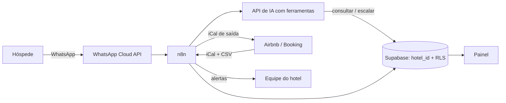

# Recepção 24h — Plano do trabalho de GMPE (v2, revisada em 27/09/2026)

> **Como usar este arquivo.** É o guia do trabalho (individual) até a apresentação de 12/11/2026. O protótipo é construído pelo Claude Code a partir do arquivo **`CLAUDE.md`**, que acompanha este plano (seção 13).
> Base: `recepcao-24h-documento-base.pdf` (pousada de ~14 quartos). Esta versão generaliza para **hotéis pequenos em geral**, formato aprovado pelo professor, **sem hotel piloto e sem entrevista**. A pesquisa de campo é feita com cliente oculto, avaliações públicas e dados setoriais.
> **Estimativa/hipótese** = número a trocar por dado da pesquisa ou fonte citada. As regras externas (Meta/WhatsApp, OTAs, Ministério do Turismo) foram conferidas em 27/09/2026 (fontes no fim).
>
> ⚠️ **A Entrega 2 é terça, 29/09.** O plano de 48h está na seção 12.1. O lote noturno do cliente oculto pode sair hoje ou amanhã à noite.

---

## 0. O que mudou nesta revisão, e por quê

| # | Mudança | Motivo |
|---|---|---|
| 1 | O trabalho é para **hotéis pequenos em geral**, demonstrado com um **hotel de referência** (parâmetros de mercado) e com um protótipo de dois hotéis fictícios | Formato aprovado pelo professor; não há empresa piloto |
| 2 | A pesquisa de campo **não tem entrevista**: cliente oculto por WhatsApp em 10–12 hotéis + análise de 100 avaliações públicas + dados setoriais | Gera evidência real do problema (tempo de resposta, dúvidas repetidas, queixas de chegada) sem depender de empresário, e cabe numa pessoa em 48h |
| 3 | Público-alvo do MVP: **5 a 20 unidades**, cada uma anunciada separadamente nas OTAs | O iCal do Booking só funciona com até 20 tipos de quarto, **1 unidade por tipo** e sem channel manager |
| 4 | M3 (calendário) reescrito: o iCal só bloqueia datas. **Valor e telefone** das reservas de OTA entram por CSV ou digitados | Sem isso, o painel e a jornada por WhatsApp ficam sem dados |
| 5 | A jornada envia o **link oficial da FNRH Digital** em vez de coletar documento | A FNRH Digital é obrigatória desde 20/04/2026. Coletar os mesmos dados duplicaria dado pessoal (LGPD) |
| 6 | O cadastro valida horários de check-in/out e a política de early/late | Portaria MTur 28/2025 (desde 15/12/2025): diária de 24h, limpeza de no máximo 3h, horários e taxas informados antes |
| 7 | WhatsApp: o custo **de cada resposta** entra no orçamento e o bot fica **restrito aos assuntos do hotel** | A Meta passa a cobrar as respostas em 01/10/2026 e proíbe chatbot de uso geral na API desde 15/01/2026 |
| 8 | Finanças por **margem de contribuição**, com comissões atualizadas (Airbnb 16%, Booking ≈ 15%), 3 cenários, **sensibilidade por diária** e payback corrigido | Sem dados de um hotel real, a sensibilidade mostra que a conclusão se sustenta numa faixa ampla |
| 9 | O convite para avaliar vai para **todos** os hóspedes | O Google proíbe pedir avaliação só a quem está satisfeito ("review gating") |
| 10 | Validação por **teste de bancada** com perguntas vindas da pesquisa de campo | Prova de eficácia viável até 27/10 |
| 11 | Escopo dimensionado para **uma pessoa**; o protótipo sai de um `CLAUDE.md` pronto para o Claude Code | Trabalho individual |

---

## 1. O eixo do trabalho em uma frase

Hotéis e pousadas pequenos vendem por canais que não conversam entre si (Airbnb, Booking, WhatsApp, telefone), e tudo o que acontece entre a reserva e o check-out depende de alguém acordado respondendo mensagem.

A **Recepção 24h** é uma solução 100% software, configurável por hotel, que atende automaticamente 24h, conduz a chegada do hóspede, unifica o calendário dos canais, transforma hóspede satisfeito em avaliação e mostra ao dono como o negócio está indo. Serve para qualquer hotel pequeno: é demonstrada com um hotel de referência e com um protótipo que roda dois hotéis diferentes na mesma plataforma.

---

## 2. Estrutura do documento final

1. **Setor e público-alvo:** MPEs de hospedagem, enquadramento típico e legislação do setor.
2. **Problema com evidências:** resultados da pesquisa de campo (cliente oculto e avaliações) e modelo de custo aplicado ao hotel de referência.
3. **Solução** (módulos) e **protótipo**.
4. **Viabilidade:** custo, ganho, cenários, sensibilidade e payback.
5. **Validação:** teste de bancada (seção 10).
6. **Visão de produto:** mensalidade, ponto de equilíbrio e APL.
7. Riscos, legislação, limitações e conclusão.

| Aspecto | Documento base | Esta versão |
|---|---|---|
| Cliente | "Pousada [nome a confirmar]", ~14 quartos | MPEs de hospedagem com 5–20 unidades; hotel de referência com parâmetros de mercado |
| Canais | Airbnb (60%) + WhatsApp (40%) fixos | Configuráveis por hotel. No MVP: Airbnb, Booking, WhatsApp, telefone e balcão |
| Base de conhecimento | Respostas de uma pousada | Uma base **por hotel**, gerada por formulário padrão |
| Chegada | Recepcionista entrega a chave | Configurável: recepção 24h, recepção com horário ou autoatendimento |
| Pesquisa de campo | Entrevista com 1 gerente | Cliente oculto + avaliações públicas + dados setoriais |
| Números | Estimativas de uma pousada | Modelo parametrizado + hotel de referência + sensibilidade |
| Produto | Implantação sob medida | Mesma plataforma para vários hotéis, com dados separados (SaaS) |

---

## 3. Público-alvo

- **Quem (MVP):** micro e pequenas empresas de hospedagem (ME/EPP) com **5 a 20 unidades**, **cada unidade anunciada separadamente** nas OTAs. É o caso típico de pousadas, chalés, flats e hostels com quartos privativos.
- **Evolução:** hotéis com 20 a 50 unidades, ou que vendem por tipo de quarto no Booking, precisam de channel manager. Nesses casos a Recepção 24h se integra ao channel manager em vez de usar iCal.
- **Perfil típico:** o dono ou gerente acumula funções, a recepção não é 24h, vende por 1 a 3 OTAs + WhatsApp e controla as reservas no app da OTA + planilha/caderno.
- **Por que MPE:** os grandes já têm PMS e channel manager, enquanto o pequeno vive no improviso. A solução é barata, 100% software e dispensa equipamento.
- **Nota para a Unidade I:** o hotel de referência (15 quartos, diária de R$ 250, 55% de ocupação) fatura ≈ R$ 750 mil/ano. Isso é **EPP** (acima do teto de ME, R$ 360 mil). Mesmo "pequeno", o hotel típico da faixa-alvo tende a ser EPP.

Personas para os slides:
1. **Pousada de praia** (8–15 quartos, sazonal, muito Airbnb). **Perfil principal.**
2. **Chalés na serra** (5–10 unidades, sem recepção fixa, chegada por autoatendimento).
3. **Hotel urbano pequeno** (20–40 quartos, muito Booking). **Mostra o limite:** precisa de channel manager e entra como evolução.

---

## 4. O problema

### Dor 1: o atendimento nunca para
As mesmas perguntas o dia inteiro: estacionamento, pet, horários, café, wifi, como chegar, berço, chegada tarde, desconto. As OTAs medem o tempo de resposta, e demorar derruba ranqueamento e selos. **Evidência:** tempo de resposta medido no cliente oculto, sobretudo à noite.

### Dor 2: a chegada do hóspede é um improviso
Chegadas fora de hora, informação perdida em conversas longas e ligação de madrugada de hóspede que não achou a entrada. **Evidência:** % de avaliações que citam chegada, check-in ou dificuldade de contato.

### Dor 3: ninguém sabe como o negócio está indo
Com reservas espalhadas pelos canais, o dono não sabe a ocupação, a diária média (ADR), o RevPAR, qual canal rende mais depois da comissão nem quais dias ficam vazios. Há ainda risco de overbooking entre canais. **Evidência:** argumento de processo (vários canais sem integração) + comissões públicas das OTAs.

### Custo do problema: modelo parametrizado (hotel de referência)

| Parâmetro | Valor | De onde vem |
|---|---|---|
| Unidades (U) | 15 | Hotel de referência (meio da faixa-alvo) |
| Diária média (D) | R$ 250 | Mediana das diárias anunciadas na amostra do cliente oculto (substituir) |
| Ocupação média (O) | 55% | Dado setorial com fonte, ou hipótese com sensibilidade |
| Estadia média (E) | 2,5 noites | Hipótese |
| Custo variável por noite ocupada (CV): lavanderia, café, amenities, energia | R$ 45 | Hipótese |
| Comissão média das OTAs (c) | 16% | Pública (Airbnb 16%, Booking ≈ 15%) |
| Mensagens recebidas por dia | 70 | Hipótese (≈ 4–5 por quarto) |
| Horas por dia respondendo mensagens repetitivas (H) | 3 h | Hipótese |
| Valor da hora de quem responde (VH) | R$ 15 | Piso da recepção no ES + encargos (citar fonte) ou hipótese |

Derivados: noites vendidas/mês = U × 30 × O ≈ **248**; reservas/mês = noites ÷ E ≈ **99**.

**Margem por noite** (o que sobra de cada noite vendida):
- canal direto: D − CV = 250 − 45 = **R$ 205**
- via OTA: D × (1 − c) − CV = 210 − 45 = **R$ 165**
- via OTA com promoção de −20%: 200 × 0,84 − 45 = **R$ 123**

| Origem | Fórmula | Exemplo por ano |
|---|---|---|
| Reservas diretas perdidas por demora | reservas/mês × noites × margem direta × 12 | 2 × 2 × 205 × 12 = **R$ 9.840** |
| Dias fracos sem ação (nenhuma promoção) | noites/mês × margem com promoção × 12 | 4 × 123 × 12 = **R$ 5.904** |
| Tempo em mensagens repetitivas | H × 365 × VH | 3 × 365 × 15 = **R$ 16.425** (1.095 h; é tempo, não caixa) |
| Overbooking | ocorrências/ano × (realocação + penalidade da OTA) | Citado qualitativamente (sem dado) |
| **Total** | | **≈ R$ 15,7 mil/ano em margem + ≈ 1.100 h/ano** |

O custo do problema é um teto, e não uma promessa de ganho. A seção 8 aplica cenários e sensibilidade.

---

## 5. A solução: módulos e funcionalidades

Princípio de projeto: **o hóspede nunca espera por uma pessoa para resolver algo simples, e a equipe só é acionada quando o assunto exige alguém** (reclamação, negociação, imprevisto).

Legenda: **MVP** = entra no protótipo e na apresentação · **Futuro** = citado como evolução.

### M0 — Cadastro e configuração do hotel (é o que torna a solução replicável)
- **MVP:** dados do hotel (nome, cidade, endereço, contatos, políticas de pet, criança, cancelamento, estacionamento e café).
- **MVP:** horários de check-in e check-out, com **validação do intervalo entre check-out e check-in de no máximo 3h** (Portaria MTur 28/2025), e política de early check-in/late check-out (permite? quanto custa?).
- **MVP:** tipos de acomodação e unidades (quantidade, capacidade, tarifa base).
- **MVP:** canais usados, comissão de cada um e **forma de anúncio** (por unidade ou por tipo), que define se o iCal funciona.
- **MVP:** formulário padrão que gera a base de conhecimento. As ~15 perguntas frequentes já vêm como modelo e o hotel só responde.
- **MVP:** modo de chegada (recepção 24h / com horário / autoatendimento) e link/QR de pré-check-in da **FNRH Digital** do hotel.
- **Futuro:** vários usuários por hotel com papéis, tom de voz por hotel e idiomas (PT/EN/ES).

### M1 — Atendimento automático 24h
- **MVP:** recebe a mensagem (no protótipo, por um chat web que simula o WhatsApp), identifica o hotel, consulta **só a base daquele hotel** e responde em linguagem natural.
- **MVP:** **escopo restrito**. O bot responde sobre o hotel, a estadia e a região (a partir da base) e recusa com educação qualquer outro assunto. Isso atende à política da Meta e controla o custo.
- **MVP:** identifica-se como assistente virtual e sempre oferece falar com uma pessoa.
- **MVP:** escala para humano quando não sabe a resposta, em reclamação, pedido de desconto/negociação ou quando o hóspede pede atendente. O bot pausa naquela conversa e avisa a equipe.
- **MVP:** consulta disponibilidade por data e tipo e informa a tarifa base. **Não fecha reserva nem dá desconto.**
- **Futuro:** WhatsApp oficial (Cloud API), mensagens das OTAs via channel manager e pré-reserva com link de Pix.

### M2 — Jornada de chegada automatizada

| Momento | Mensagem |
|---|---|
| Na confirmação | Resumo da reserva, **horários de check-in/out, taxas de early/late** e política de cancelamento |
| 3 dias antes | Boas-vindas, endereço com mapa, estacionamento e **link da FNRH Digital** para pré-check-in |
| 1 dia antes | "Qual seu horário previsto de chegada?" (a resposta fica registrada na reserva) |
| No dia, ~3h antes | Instruções de entrada conforme o modo de chegada |
| Na chegada | Wifi, horário do café e contato de emergência |
| Durante | Bot 24h para dúvidas do quarto e da cidade |

- **MVP:** agendamento por reserva, registro da hora prevista e alerta à equipe se o hóspede não responder (reenvia 1 vez e depois avisa).
- **Para quem:** reservas com telefone e consentimento. Para reservas de OTA sem telefone, os mesmos textos vão pelas mensagens programadas da própria OTA **[verificar na E3 os recursos atuais do Airbnb e do Booking]**.
- **Regra do WhatsApp:** fora da janela de 24h depois da última mensagem do hóspede, só é possível enviar template aprovado (categoria "utilidade").
- **Futuro:** integração com o sistema da FNRH Digital (alguns PMS já oferecem).

### M3 — Calendário único
- **MVP:** importar o iCal de cada anúncio do Airbnb e do Booking **quando elegível** (Booking: até 20 tipos, 1 unidade por tipo, sem channel manager) e exportar um iCal por unidade.
- **MVP:** uma reserva direta lançada no sistema bloqueia a data em todos os canais.
- **MVP:** alerta de conflito (duas reservas para a mesma unidade e data).
- **MVP:** **o iCal traz só as datas ocupadas.** Valor, nº de hóspedes e telefone das reservas de OTA entram pelo CSV de reservas da OTA ou são digitados.
- **Limitação declarada:** a sincronização por iCal tem atraso de minutos a horas, o que deixa um risco residual de overbooking.
- **Futuro:** channel manager para hotéis que vendem por tipo de quarto ou com mais de 20 unidades.

### M4 — Pós-estadia e avaliação
- **MVP:** pesquisa interna de 1 a 5 no check-out. Nota de 1 a 3 gera **alerta imediato** para a equipe entrar em contato.
- **MVP:** o convite para avaliar no canal de origem e no Google vai para **todos**, sem incentivo (política do Google).
- **Futuro:** cupom para reserva direta na próxima visita, o que reduz a comissão de OTA.

### M5 — Painel de gestão
Ocupação (por dia, mês e **dia da semana**), ADR, RevPAR, receita bruta e **líquida por canal**, **% de reservas diretas**, antecedência média, nota média, **taxa de resolução do bot** e tempo da 1ª resposta. **MVP:** uma página de painel no próprio protótipo.

---

## 6. Arquitetura e tecnologias

### Arquitetura de produção (a que vai no documento)
- **n8n:** orquestra os fluxos (webhooks, agendamentos, iCal).
- **API de IA** (ex.: Claude Haiku 4.5), usando **ferramentas**: `consultar_disponibilidade`, `escalar_para_humano` e `registrar_hora_chegada`. Responde só com base no contexto do hotel.
- **WhatsApp Business Platform (Cloud API oficial):** cada hotel com seu número e sua conta, e a Meta cobra direto do hotel. **APIs não oficiais (ex.: Evolution API) ficam descartadas** pelo risco de bloqueio do principal canal de venda.
- **iCal** para hotéis elegíveis e **channel manager** (evolução) para os demais.
- **Supabase (Postgres):** um banco para todos os hotéis, com `hotel_id` em tudo e Row Level Security.
- **Painel:** página própria ou Looker Studio.

O **protótipo** usa Python + FastAPI + SQLite com o mesmo modelo de dados. O n8n fica como arquitetura de produção descrita no documento.

### Fluxo 1: atendimento
1. A mensagem chega → webhook → identifica o hotel e o hóspede (telefone).
2. Se a conversa está com humano, só registra e notifica a equipe.
3. Monta o contexto: base do hotel + histórico curto + ferramentas.
4. A IA responde, consulta disponibilidade ou escala. Se a base não cobre a pergunta, **escala em vez de inventar**.
5. Registra a mensagem e se ela foi resolvida pelo bot (alimenta o painel).

---

## 7. Dados

O modelo de dados completo (entidades, campos e fórmulas dos indicadores) está no `CLAUDE.md`, seção "Modelo de dados", e vale igualmente para o documento. Entidades: Hotel, TipoAcomodacao, Unidade, Canal, CalendarioExterno, Hospede (sem documento), Reserva, ItemBaseConhecimento, Conversa, Mensagem, MensagemAgendada, Avaliacao, Alerta e UsuarioEquipe.

Indicadores:
- **Ocupação** = noites vendidas ÷ (unidades ativas × dias do período)
- **ADR** = receita de hospedagem ÷ noites vendidas
- **RevPAR** = receita ÷ (unidades × dias) = ocupação × ADR
- **Receita líquida por canal** = receita do canal × (1 − comissão)
- **% reservas diretas** = reservas sem comissão ÷ total
- **Taxa de resolução do bot** = conversas encerradas sem escalonamento ÷ total

---

## 8. Investimento e retorno

### 8.1 Custo mensal por hotel (estimativas; a cotação com fonte e data entra na E3)

| Item | Pequeno (5–20 unid.) | Médio (20–50 unid.) | Observação |
|---|---|---|---|
| n8n (VPS própria) | R$ 30–130 | R$ 60–200 | |
| API de IA | R$ 40–80 | R$ 80–200 | ~2 mil respostas/mês ≈ US$ 10 com modelo rápido (Haiku 4.5: US$ 1 / US$ 5 por milhão de tokens de entrada/saída) |
| WhatsApp (tarifas da Meta) | R$ 80–150 | R$ 150–300 | ~2.600 mensagens/mês × ≈ R$ 0,04. As respostas passam a ser cobradas em 01/10/2026 |
| Supabase | R$ 0 | R$ 0–130 | |
| Painel | R$ 0 | R$ 0 | |
| Channel manager | — | a cotar | Só no médio |
| **Total** | **≈ R$ 150–360/mês** | **≈ R$ 290–830/mês + channel manager** | |

Mensagens de WhatsApp no exemplo: 70 respostas/dia × 30 = 2.100; jornada = 99 reservas × 60% com WhatsApp × 6 mensagens ≈ 360; pós-estadia ≈ 120. Total ≈ 2.600.

### 8.2 Investimento inicial (implantação)
Montar a base de conhecimento com o dono (3–4 h), verificar o número e aprovar os templates no WhatsApp, configurar os iCal e treinar a equipe (2 h). Para o cálculo: **R$ 500** (estimativa, ou a taxa de implantação, se virar produto).

### 8.3 Ganho mensal no hotel de referência: 3 cenários

| | Conservador | Realista | Otimista |
|---|---|---|---|
| Reservas diretas recuperadas/mês (2 noites × R$ 205) | 1 → R$ 410 | 2 → R$ 820 | 3 → R$ 1.230 |
| Noites extras em dias fracos (promoção via OTA, R$ 123/noite) | 2 → R$ 246 | 4 → R$ 492 | 6 → R$ 738 |
| **Ganho em margem/mês** | **R$ 656** | **R$ 1.312** | **R$ 1.968** |
| (−) custo mensal (R$ 300) | R$ 356 | R$ 1.012 | R$ 1.668 |
| **Payback dos R$ 500 iniciais** | ≈ 1,4 mês | ≈ 0,5 mês | ≈ 0,3 mês |
| Horas liberadas (bot resolve 50% / 70% / 85% das 3 h/dia) | 45 h ≈ R$ 675 | 63 h ≈ R$ 945 | ≈ 77 h ≈ R$ 1.148 |

### 8.4 Sensibilidade: quantas noites a mais por mês pagam a solução?
**Ponto de equilíbrio** = custo mensal (R$ 300) ÷ margem por noite. Esse número não depende da ocupação, só da diária, e por isso funciona bem sem dados de um hotel real.

| Diária média | Margem/noite via OTA | Noites/mês para pagar (OTA) | Margem/noite direta | Noites/mês para pagar (direto) |
|---|---|---|---|---|
| R$ 150 | R$ 81 | ≈ 3,7 | R$ 105 | ≈ 2,9 |
| R$ 250 | R$ 165 | ≈ 1,8 | R$ 205 | ≈ 1,5 |
| R$ 400 | R$ 291 | ≈ 1,0 | R$ 355 | ≈ 0,8 |

Na fala da banca: *"dependendo da diária, a solução se paga com 1 a 4 noites a mais por mês."*

### 8.5 Visão de produto (orçamento empresarial; liga com a aula de orçamento)
- **Preço:** R$ 249/mês por hotel, comparado com o preço de ferramentas similares (benchmark de 3 ferramentas na E3).
- **WhatsApp pago pelo hotel**, direto na conta dele na Meta. É realista (cada hotel tem seu número) e tira do produto o maior custo variável.
- **Custo variável por hotel** (IA): ≈ R$ 60/mês. **Custos fixos** da operação (servidor, banco pago, domínio, contador): ≈ R$ 600/mês (estimativa).
- **Margem de contribuição** = 249 − 60 = R$ 189 por hotel. **Ponto de equilíbrio** = 600 ÷ 189 ≈ 3,2, ou seja, **4 hotéis**.
- **Com 10 hotéis:** receita de R$ 2.490 e resultado de 10 × 189 − 600 = **R$ 1.290/mês**, antes dos impostos (Simples Nacional) e sem contar o tempo de trabalho.
- **APL (Unidade IV):** 10 pousadas de um mesmo polo turístico (ex.: serra ou litoral capixaba) dividindo a plataforma é um exemplo de cooperação em APL de turismo.

---

## 9. Riscos e cuidados

| Risco | Tratamento |
|---|---|
| Sem dados primários de um hotel | Cliente oculto + avaliações dão evidência do problema; os números financeiros ficam em sensibilidade (8.4). É uma limitação declarada |
| IA negociar sozinha | Desconto, condição especial e reclamação sempre vão para humano |
| IA inventar resposta | Responde só com a base do hotel e escala o que não souber. O teste de bancada mede isso |
| Resposta com dado de outro hotel | Isolamento por `hotel_id` + teste automatizado com dois hotéis |
| Hóspede que não quer robô | Caminho imediato para falar com gente. O bot se identifica como assistente virtual |
| Política da Meta (chatbot de uso geral) | Bot restrito ao hotel, à estadia e à região |
| Custo por mensagem (a partir de 01/10/2026) | Respostas completas numa mensagem só, volume no painel e cobrança na conta do hotel |
| Número bloqueado | Só a API oficial; mensagem ativa só com consentimento e template aprovado |
| iCal não elegível no Booking | Pré-requisito declarado na adoção. Se o hotel vende por tipo, o M3 vira evolução (channel manager) |
| Atraso do iCal | Sincronização curta + alerta de conflito. Risco residual declarado |
| FNRH e LGPD | Documento fica na FNRH Digital (só enviamos o link). Consentimento, dado mínimo e política de privacidade |
| Portaria MTur 28/2025 | Horários e taxas de early/late cadastrados, validados e informados na confirmação |
| Avaliação seletiva | Convite para todos e sem incentivo |
| Regras das OTAs sobre contato fora da plataforma | Não levar o hóspede para fora da OTA antes da reserva confirmada **[verificar na E3]** |
| Base desatualizada | Painel mostra a data da última revisão de cada item |

---

## 10. Validação

| Hipótese | Como testar | Meta |
|---|---|---|
| H1 — hotéis pequenos demoram a responder, principalmente à noite | Cliente oculto (Anexo A): tempo até a 1ª resposta, lote noturno × diurno | Mostrar a mediana e o % sem resposta em 1h |
| H2 — chegada e comunicação pesam nas avaliações | 100 avaliações públicas classificadas (Anexo C) | Mostrar o % de menções entre as negativas |
| H3 — o bot responde certo | Script de bancada com ~40 perguntas montadas a partir da pesquisa; cada resposta marcada como certa / errada / escalou corretamente (um colega pode conferir 10 casos) | ≥ 80% certas ou escaladas corretamente; 0 respostas com dado de outro hotel |
| H4 — a solução se paga | Cenários (8.3) e sensibilidade (8.4) | Cenário conservador ≥ custo mensal |

As metas são referências. O que vale na banca é mostrar o número obtido e explicar os erros.

---

## 11. Ligação com o conteúdo da disciplina

- **Unidade I (legislação):** enquadramento típico (ME/EPP, LC 123/2006), Cadastur, **FNRH Digital** (Portaria MTur 41/2025, obrigatória desde 20/04/2026), **Portaria MTur 28/2025** (diária de 24h, limpeza ≤ 3h, informação prévia de horários e taxas), LGPD e dever de informação ao consumidor.
- **Unidade II (finanças):** custo do problema, margem de contribuição por canal, cenários, sensibilidade, payback e orçamento do produto.
- **Unidade III (marketing e IA):** chatbot de atendimento, experiência do hóspede, avaliação como ativo, promoção em dias fracos e canal direto × OTA.
- **Unidade IV (APL):** hotéis de um mesmo polo dividindo a plataforma.
- **Unidade V (prática):** pesquisa de campo, proposta, protótipo e validação.

---

## 12. Cronograma (atualizado em 27/09)

| Data | Entrega | Foco |
|---|---|---|
| 15/09 (ter) | 1 — Escopo | Já passou. Esta v2 atualiza o escopo |
| **29/09 (ter)** | **2 — Pesquisa de campo** | **Em 2 dias.** Cliente oculto + avaliações + dados setoriais (12.1) |
| 30/09–05/10 | (adiantar) Protótipo | Claude Code com o `CLAUDE.md`. Isso alivia a E3 e a E4 em volta da prova |
| 08/10 (qui) | Prova de GMPE | Reservar 06–07/10 para estudar |
| 13/10 (ter) | 3 — Arquitetura | Diagrama (seção 6), modelo de dados, formulário M0, cotação com fontes, benchmark de preço, regras atuais de OTAs e WhatsApp |
| 27/10 (ter) | 4 — Protótipo | Protótipo com 2 hotéis + resultado da bancada + painel + vídeo de até 2 min |
| 10/11 (ter) | 5 — Ensaio | Slides, fala cronometrada e perguntas da banca (seção 14) |
| 12/11 (qui) | Final | PDF + apresentação |

### 12.1 Plano das próximas 48h (E2, uma pessoa)
- **Domingo à noite ou segunda à noite (21h–23h):** montar a lista de 10–12 hotéis/pousadas pequenos do ES que divulgam WhatsApp (Google Maps/Booking; ~30 min) e enviar o **lote noturno** para metade deles (Anexo A).
- **Segunda (28/09):** enviar o **lote diurno** (10h–16h) para a outra metade; analisar 100 avaliações (5 hotéis × 20, ~2 h; Anexo C); buscar ocupação média e diária média de referência numa fonte setorial (~1 h).
- **Terça (29/09):** fechar as fichas, calcular os indicadores (mediana do tempo de resposta, % sem resposta em 1h, % com resposta automática, temas das avaliações) e escrever 2–3 páginas: método, amostra, resultados, limitações e como os números alimentam o modelo da seção 4.
- **Mínimo aceitável:** 8 hotéis contatados, 50 avaliações analisadas e parâmetros com fonte ou marcados como hipótese.

### 12.2 Checklist por entrega
- **E2:** [ ] fichas do cliente oculto (Anexo B) · [ ] 100 avaliações classificadas · [ ] parâmetros da seção 4 com fonte ou hipótese · [ ] relatório de 2–3 páginas
- **E3:** [ ] diagrama · [ ] modelo de dados · [ ] formulário M0 · [ ] cotação com fonte, data e câmbio · [ ] benchmark de 3 ferramentas · [ ] regras atuais do Airbnb, Booking e WhatsApp
- **E4:** [ ] testes do protótipo passando · [ ] resultado da bancada · [ ] vídeo de até 2 min · [ ] plano B (modo demo + prints)

---

## 13. Protótipo — como mandar para o Claude Code

1. Crie uma pasta vazia (ex.: `recepcao24h`) e coloque dentro o **`CLAUDE.md`** (e, se quiser, este plano como `docs/plano.md`).
2. Abra o Claude Code nessa pasta e mande:

   > Leia o CLAUDE.md e construa o protótipo seguindo as etapas na ordem. Ao fim de cada etapa, rode os testes, corrija o que falhar e me dê um resumo curto. Só pare para perguntar se algo bloquear.

3. **Opcional:** para usar a IA de verdade, defina `ANTHROPIC_API_KEY`. Sem a chave, o protótipo roda em modo demo, que também é o plano B da apresentação.
4. Depois da E2, coloque as perguntas montadas a partir da pesquisa em `data/perguntas_teste.csv` e rode a bancada.

---

## 14. Perguntas prováveis da banca

1. **"Vocês não entrevistaram nenhum hotel?"** Não. O problema foi medido de fora, como o hóspede vê: cliente oculto em N hotéis (mediana de X min para responder, Y% sem resposta à noite) e 100 avaliações públicas. Os números financeiros vêm em sensibilidade.
2. **"Por que não usar as mensagens programadas do Airbnb/Booking?"** Elas só cobrem aquele canal. Na amostra, N de M hotéis divulgam WhatsApp para reservas. A Recepção 24h unifica os canais e mede o resultado.
3. **"Por que não um PMS ou channel manager pronto?"** Custo e complexidade para 5–20 unidades, e eles não resolvem o atendimento 24h. Para hotéis maiores, a proposta se integra ao channel manager.
4. **"E se a IA errar?"** Ela só responde com a base do hotel, escala o resto e nunca negocia. A bancada mostra a taxa de acerto real.
5. **"E a LGPD?"** Consentimento, dado mínimo, documento na FNRH Digital (e não no nosso sistema) e isolamento entre hotéis.
6. **"Quanto custa e quando se paga?"** ≈ R$ 300/mês, que se pagam com 1 a 4 noites a mais por mês, conforme a diária.
7. **"O WhatsApp não proibiu chatbot?"** Proibiu assistente de uso geral. Atendimento de empresa é permitido, e o bot é restrito ao hotel.
8. **"iCal não dá overbooking?"** Existe atraso. Por isso há alerta de conflito e o escopo é limitado a hotéis elegíveis.

---

## 15. Decisões

**Tomadas:**
- Formato: hotéis em geral, sem piloto e sem entrevista (aprovado pelo professor).
- Nome: **Recepção 24h**.
- Canais do MVP: Airbnb, Booking, WhatsApp, telefone e balcão. Site próprio fica fora.
- Visão de produto: incluída (8.5).
- Protótipo: Python + FastAPI + SQLite, via Claude Code, com n8n na arquitetura do documento.
- Público-alvo: 5–20 unidades; hotéis maiores ficam como evolução.
- Trabalho feito individualmente.

**Em aberto:** a fonte da ocupação média de referência (define se os 55% saem de hipótese para dado).

---

## Anexo A — Protocolo do cliente oculto

- **Amostra:** 10–12 pousadas/hotéis com 5–20 unidades no ES (litoral e serra) que divulgam WhatsApp no Google Maps, no Instagram ou no site.
- **Lotes:** metade no lote noturno (21h–23h), metade no lote diurno (10h–16h). **Um contato por hotel.**
- **Mensagem padrão** (igual para todos): *"Olá! Vocês aceitam pet de pequeno porte? E qual o horário de check-in?"*
- **Registrar** (Anexo B): hora do envio, hora da 1ª resposta (ou "sem resposta em 24h"), se foi resposta automática, se respondeu as duas perguntas, se ofereceu reserva ou link.
- **Ética:** perguntas simples e reais, sem fazer reserva, sem pedir desconto e sem insistir. Encerrar com "Obrigado pela informação!". No trabalho, hotéis anonimizados (Hotel A, B, C…), só com região e porte.
- **Indicadores:** mediana do tempo até a 1ª resposta (noite × dia), % sem resposta em 1h e em 12h, % com resposta automática, % que respondeu tudo e nº que divulga WhatsApp para reservas.

## Anexo B — Ficha do cliente oculto

| Hotel | Região | Unidades (aprox.) | Canais onde anuncia | Diária anunciada (data de referência) | Lote | Envio | 1ª resposta | Min. até responder | Automática? | Respondeu tudo? | Obs. |
|---|---|---|---|---|---|---|---|---|---|---|---|
| A | | | | | noite | | | | | | |
| B | | | | | dia | | | | | | |

## Anexo C — Ficha de análise de avaliações

- **Amostra:** 5 hotéis pequenos (podem ser da amostra do cliente oculto) × 20 avaliações mais recentes (Google ou Booking) = 100.
- **Para cada avaliação:** nota (positiva ≥ 4 / negativa ≤ 3) e temas citados: chegada/check-in · comunicação/demora para responder · informação desencontrada (políticas, pet, café, horários) · limpeza · preço · estrutura · outro.
- **Resultado:** % de avaliações que citam cada tema (total e só as negativas) + 3–5 trechos curtos anonimizados como exemplo.

---

## Fontes (conferidas em 27/09/2026)

- [Booking.com for Partners — Sincronização de calendários (requisitos do iCal)](https://partner.booking.com/en-us/help/rates-availability/extranet-calendar/syncing-your-bookingcom-calendar-third-party-calendars)
- [Meta for Developers — Pricing for non-template messages (cobrança a partir de 01/10/2026)](https://developers.facebook.com/documentation/business-messaging/whatsapp/pricing/non-template-messages)
- [TechCrunch — WhatsApp proíbe chatbots de uso geral na Business API (vigente desde 15/01/2026)](https://techcrunch.com/2025/10/18/whatssapp-changes-its-terms-to-bar-general-purpose-chatbots-from-its-platform/)
- [Message Central — preços do WhatsApp no Brasil em 2026 (utilidade ≈ R$ 0,04–0,05; fonte secundária)](https://www.messagecentral.com/blog/whatsapp-business-api-pricing-brazil)
- [Panrotas — FNRH Digital obrigatória desde 20/04/2026](https://www.panrotas.com.br/hotelaria/mercado/2026/04/ficha-nacional-de-registro-de-hospedes-fnrh-passa-a-ser-obrigatoria-no-brasil_227816.html)
- [MPPR — Portaria MTur nº 28/2025 (diária, horários e limpeza)](https://site.mppr.mp.br/consumidor/Noticia/Ministerio-do-Turismo-estabelece-regras-para-check-check-out-e-servicos-de)
- [Guesty (Central de Ajuda) — taxa única do Airbnb: 16% para anúncios no Brasil](https://help.guesty.com/hc/pt-br/articles/9362649851037-Entendendo-as-taxas-de-servi%C3%A7o-do-Airbnb-para-anfitri%C3%B5es-e-h%C3%B3spedes)
- [HostnJoy — comissão padrão do Booking no Brasil ≈ 15% (fonte secundária)](https://hostnjoy.com.br/blog/diferencas-booking-airbnb)
- [Google — política de conteúdo do Maps (proíbe pedir avaliação seletivamente e oferecer incentivo)](https://support.google.com/contributionpolicy/answer/7400114?hl=en)
