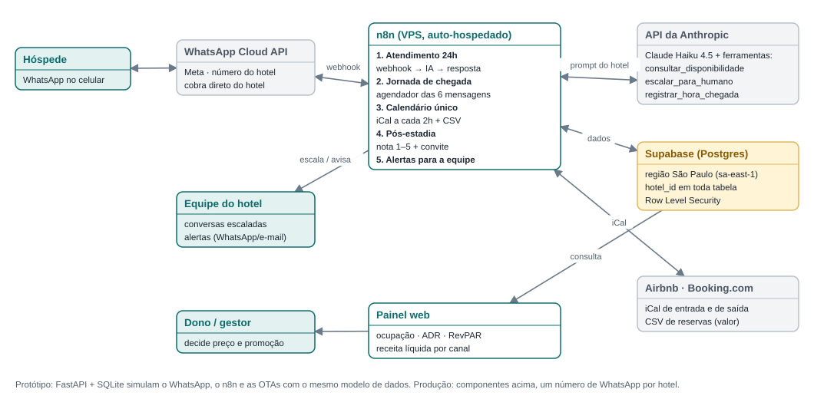
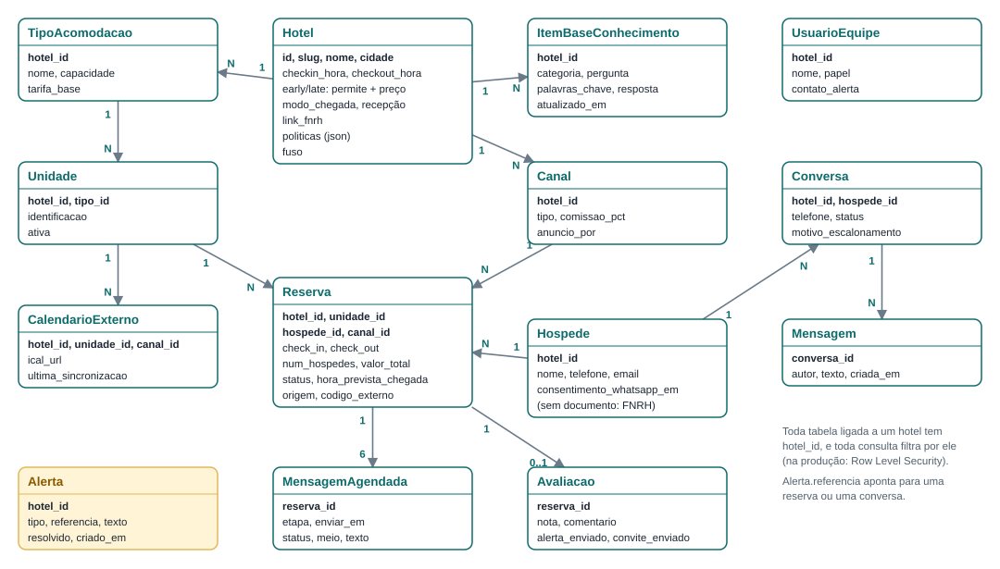

# Entrega 3 — Arquitetura da Recepção 24h

Gestão de Micro e Pequenas Empresas · Sistemas de Informação · UVV · versão de 28/09/2026

Este documento reúne o que a Entrega 3 pede: a arquitetura de produção, o modelo de dados, o formulário de cadastro
(M0), a cotação de custos com fonte e data, o benchmark de preço e as regras atuais do Airbnb, do Booking.com e do
WhatsApp. Preços e regras foram conferidos nas fontes oficiais em **28/09/2026** (lista completa no fim).
Câmbio usado: **PTAX de venda do Banco Central de 28/09/2026 — US$ 1 = R$ 5,2132 e € 1 = R$ 5,9253.**

---

## 1. Arquitetura de produção

| Componente | Papel | Por que este |
|---|---|---|
| **WhatsApp Cloud API** (Meta) | Canal com o hóspede. Cada hotel tem o próprio número e a própria conta, e a Meta cobra direto do hotel. | É a API oficial. APIs não oficiais (ex.: Evolution API) ficam descartadas pelo risco de bloqueio do principal canal de venda. |
| **n8n Community** numa VPS | Orquestra os fluxos: recebe as mensagens (webhook), agenda a jornada, importa e exporta iCal, envia alertas. | Código aberto e sem licença. O plano em nuvem Starter tem limite de 2.500 execuções/mês, pouco para ~2.500 mensagens por hotel. |
| **API da Anthropic** (Claude Haiku 4.5) | Responde ao hóspede só com a base do hotel e usa três ferramentas: `consultar_disponibilidade`, `escalar_para_humano` e `registrar_hora_chegada`. | Modelo rápido e barato (seção 5). O `hotel_id` vem da conversa, nunca de um parâmetro da IA. |
| **Supabase** (Postgres) | Banco único para todos os hotéis, com `hotel_id` em toda tabela e Row Level Security. | Região São Paulo (`sa-east-1`) disponível: os dados ficam no Brasil. Plano gratuito para começar. |
| **Airbnb e Booking.com** | Entram por iCal (datas ocupadas) e CSV (valor e telefone). Recebem um iCal de saída por unidade. | É a integração possível sem channel manager (seção 7). |
| **Painel web** | Ocupação, ADR, RevPAR, receita líquida por canal, % diretas, resolução do bot e nota média. | Lê o mesmo banco; página própria. |

O **protótipo** (repositório `RodrigoFass/recepcao-24h`) implementa tudo isso localmente com FastAPI, SQLite e
Jinja2, usando o mesmo modelo de dados: o chat web simula o WhatsApp, um relógio simulado faz o papel do agendador do
n8n e a importação de arquivos `.ics` simula o iCal das OTAs.

## 2. Fluxos principais

**Atendimento (M1).** (1) A mensagem chega pelo webhook, e o sistema identifica o hotel (pelo número que recebeu) e o
hóspede (pelo telefone). (2) Se a conversa está com a equipe, só registra e avisa a equipe. (3) Senão, monta o
contexto — dados e base de conhecimento **só daquele hotel**, as últimas 10 mensagens e as três ferramentas — e chama a
IA. (4) A IA responde, consulta a disponibilidade, registra o horário de chegada ou escala para a equipe: desconto,
reclamação, pedido de atendente ou pergunta que a base não cobre. Assunto fora do hotel recebe uma recusa educada,
sem escalar. (5) A mensagem é registrada, alimentando o painel.

**Jornada de chegada (M2).** Toda reserva gera seis mensagens: confirmação (na hora), boas-vindas com o link da FNRH
Digital (3 dias antes, 10h), pergunta do horário de chegada (1 dia antes, 10h), instruções de entrada (3h antes do
check-in), chegada com wifi e café (no horário do check-in) e pesquisa de 1 a 5 (2h depois do check-out). Sem telefone
ou sem consentimento, os mesmos textos ficam prontos para a equipe copiar nas mensagens programadas da OTA. Sem
resposta sobre o horário em 6h, a pergunta é reenviada; mais 6h sem resposta geram alerta para a equipe.

**Calendário (M3).** O n8n importa o iCal de cada anúncio (o Booking atualiza a cada 2 horas) e exporta um iCal por
unidade. Reserva manual que sobrepõe outra é recusada; importação que sobrepõe gera alerta de conflito. Reserva de OTA
sem valor fica pendente até a equipe completar (CSV ou digitação).

**Pós-estadia (M4).** Nota de 1 a 3 gera alerta imediato. O convite para avaliar no canal de origem e no Google vai
para **todos**, sem oferecer vantagem.

## 3. Modelo de dados

- **Isolamento por hotel:** toda tabela ligada a um hotel tem `hotel_id`, e toda consulta filtra por ele. No
  protótipo isso é garantido pelo código e por testes automáticos; na produção, também por Row Level Security.
- **LGPD:** `Hospede` não guarda documento — ele fica na FNRH Digital, e o sistema só envia o link. O consentimento
  para mensagens de WhatsApp fica registrado com data (`consentimento_whatsapp_em`).
- **Reservas de OTA:** `valor_total` e `hospede_id` podem ser nulos, porque o iCal só traz as datas.
- **Jornada:** `MensagemAgendada.meio` distingue o envio por WhatsApp do texto para copiar no chat da OTA
  (`ota_manual`).
- **Alertas:** tipos `conflito`, `sem_resposta`, `nota_baixa`, `escalonamento` e `valor_pendente`; `referencia`
  aponta para a reserva ou a conversa.

## 4. Formulário de cadastro (M0)

O formulário está implementado no protótipo (`/hoteis/novo`) e, depois de salvo, o hotel já funciona no chat.

| Grupo | Campos | Validações |
|---|---|---|
| Hotel | nome, cidade, endereço, telefone, WhatsApp | nome, cidade e endereço obrigatórios |
| Horários | check-in, check-out; early check-in (permite? a partir de? preço?); late check-out (permite? até? preço?) | **intervalo check-out → check-in de no máximo 3 horas (Portaria MTur nº 28/2025)**; check-in depois do check-out; early antes do check-in; late depois do check-out |
| Chegada | modo (recepção 24h, recepção com horário, autoatendimento), horário de atendimento, instruções de entrada, contato de emergência, link da FNRH Digital | horário obrigatório para "recepção com horário" |
| Wifi e pet | rede, senha, observação; aceita pet | — |
| Acomodações | até 4 tipos: nome, pessoas, tarifa base, unidades (aceita faixas como `101-108`) | ao menos 1 tipo; unidades sem repetição; capacidade e tarifa > 0 |
| Canais | Airbnb, Booking, WhatsApp, telefone, balcão; comissão (%); anuncia por unidade ou por tipo | ao menos 1 canal |
| Base de conhecimento | 12 perguntas-modelo: pet, café, estacionamento, como chegar, chegada fora do horário, crianças/berço, cancelamento, pagamento, lazer, silêncio, roupa de cama, turismo | pergunta sem resposta → o bot passa para a equipe |
| Geradas dos campos | horários, early check-in, late check-out, wifi | sem risco de informação desencontrada |

## 5. Cotação de custos (28/09/2026)

**Premissas — hotel de referência do plano:** 15 unidades, 70 mensagens recebidas por dia (2.100 respostas por mês),
99 reservas por mês, 60% delas com WhatsApp e consentimento, 6 mensagens por reserva.

| Item | Opção | Preço de tabela | Custo mensal | Fonte |
|---|---|---|---|---|
| IA | Claude Haiku 4.5 (API da Anthropic) | US$ 1 (entrada) e US$ 5 (saída) por milhão de tokens | **R$ 51,16** | Anthropic |
| WhatsApp | mensagem de utilidade, Brasil (cobrada na conta do hotel) | R$ 0,0350 por mensagem (até 250 mil/mês) | **R$ 85,96** (2.456 mensagens) | Meta |
| Orquestração | n8n Community, auto-hospedado | licença gratuita | R$ 0,00 | n8n |
| Servidor | VPS Hostinger KVM 2 (2 vCPU, 8 GB, 100 GB) | R$ 43,99 na promoção de 24 meses; R$ 77,99 na renovação | **R$ 77,99** | Hostinger |
| Banco | Supabase Free (500 MB) ou Pro | US$ 0 ou US$ 25/mês | R$ 0,00 a R$ 130,33 | Supabase |
| Domínio | .com.br | R$ 40,00 por ano | R$ 3,33 | Registro.br |
| **Total de uma implantação (1 hotel)** | | | **R$ 218,44 a R$ 348,77** | |

A faixa confirma a estimativa do plano (R$ 150–360/mês).

**Como a conta da IA foi feita.** O prompt real do protótipo tem cerca de 5.300 caracteres (dados e base de um
hotel) e as ferramentas, 1.400. Com a hipótese de 3,5 caracteres por token em português, mais 496 tokens fixos de uso de
ferramentas, 400 de histórico e 20 da mensagem, cada chamada tem ~2.825 tokens de entrada. Com 1,3 chamada por
resposta (30% das respostas usam uma ferramenta) e 200 tokens de saída, cada resposta custa US$ 0,00467 (≈ R$ 0,024).
Não há desconto de cache: no Haiku 4.5 ele só vale para prompts a partir de 4.096 tokens.
Sensibilidade: com 50 a 100 mensagens por dia, R$ 36,54 a R$ 73,08. Um modelo maior (Claude Sonnet 5, US$ 2/US$ 10)
custaria R$ 102,32.

**Por que não o n8n em nuvem:** o Starter (€ 24 ≈ R$ 142,21/mês) tem só 2.500 execuções; o Pro (€ 60 ≈ R$ 355,52)
custa mais que a VPS inteira.

**Visão de produto (atualiza a seção 8.5 do plano).** Com o WhatsApp pago pelo hotel direto à Meta, o custo variável
do produto por hotel é só a IA (R$ 51,16). A R$ 249/mês, a margem de contribuição é **R$ 197,84 por hotel**.

- A infraestrutura fixa (VPS + Supabase Pro + domínio = R$ 211,65) se paga com **2 hotéis**.
- Com o custo fixo total estimado no plano (R$ 600/mês, incluindo contador), o equilíbrio é de 3,03 → **4 hotéis**.
- Com 10 hotéis: 10 × R$ 197,84 − R$ 600 = **R$ 1.378,41/mês**, antes dos impostos.

## 6. Benchmark de preço (28/09/2026)

| Ferramenta | Origem | O que faz | Preço publicado | Fonte |
|---|---|---|---|---|
| **Asksuite** | Brasil | Atendimento com IA para hotéis no WhatsApp, site e Instagram; integra motor de reservas | **sob consulta** (orçamento pelo número de quartos) | Hotel Tech Report |
| **Hospedin** | Brasil | Sistema de gestão (PMS) com channel manager e motor de reservas | **a partir de R$ 59,90/mês** (10 UHs, plano básico) | blog Hospedin |
| **Smoobu** | Alemanha | Gestão de aluguel por temporada: channel manager, mensagens automáticas, site e motor de reservas | **€ 28 (1 unidade) + a partir de € 9,60 por unidade adicional** → ≈ € 133,60 ≈ **R$ 791,62/mês** para 12 unidades | Smoobu |
| **Recepção 24h** (proposta) | — | Atendimento com IA restrito ao hotel, jornada de chegada, calendário por iCal e painel | **R$ 249/mês** (+ WhatsApp na conta do hotel) | — |

**Leitura.** A Recepção 24h não é um PMS: o Hospedin é mais barato e cobre a gestão da reserva, mas as fontes
consultadas não citam atendimento com IA nem jornada automática por WhatsApp. A Asksuite é a concorrente direta no
atendimento com IA, mas não publica preço (pedir orçamento é um próximo passo). O Smoobu entrega calendário e
mensagens automáticas, mas custa ~3 vezes mais para 12 unidades e não cita IA no atendimento. O preço de R$ 249 fica
entre o PMS básico e as soluções completas, e é complementar ao PMS que o hotel já tiver.
*("Não citam" = a informação não aparece na fonte consultada; não significa que o recurso não exista.)*

## 7. Regras atuais das plataformas (conferidas em 28/09/2026)

### WhatsApp (Meta)

| Regra | Fonte | Como a Recepção 24h atende |
|---|---|---|
| Só pode mandar mensagem a quem deu o número **e** autorizou receber mensagens (opt-in) | Política do WhatsApp Business | Reserva direta registra o consentimento com data; sem ele, a jornada vai pela OTA (texto para copiar) |
| Fora da janela de 24h após a última mensagem do hóspede, só modelos aprovados | Política do WhatsApp Business | As 6 mensagens da jornada viram modelos de "utilidade" a aprovar |
| Cobrança por mensagem desde 01/07/2025; utilidade no Brasil R$ 0,0350 | Tabela de preços BRL (vigente em 01/07/2026) | Custo no orçamento (seção 5), pago pelo hotel |
| **Desde 01/10/2026, as respostas dentro da janela também são cobradas**, ao preço de utilidade | Meta for Developers — mensagens sem modelo | Uma resposta completa por mensagem; volume visível no painel |
| Automação é permitida desde que haja caminho claro e rápido para um humano | Política do WhatsApp Business | Pedido de atendente, reclamação e desconto passam para a equipe; o bot oferece chamar a equipe |
| Seção 4.7 dos termos (atualizados em 23/09/2026): IA como **funcionalidade principal** é proibida; IA auxiliar ao atendimento é permitida, sem usar os dados do WhatsApp para treinar modelos | Termos da Meta para a WhatsApp Business Platform | O bot responde só sobre o hotel e recusa o resto; as conversas não são usadas para treinar modelos |

### Airbnb

| Regra | Fonte | Como a Recepção 24h atende |
|---|---|---|
| Taxa única do anfitrião de **16%** para anúncios no Brasil | Central de Ajuda, artigo 1857 | Comissão configurável por canal; usada na receita líquida do painel |
| Antes da reserva confirmada, toda comunicação deve ser pelo Airbnb; pagamento fora é proibido | Artigo 2799 | O bot não aborda hóspedes do Airbnb antes da confirmação e não oferece pagamento por fora |
| O telefone do hóspede só aparece depois da confirmação, e o número temporário do Airbnb não funciona no WhatsApp | Artigo 4155 | Sem número real e consentimento, a jornada vai pelas mensagens do próprio Airbnb |
| O anfitrião pode agendar respostas rápidas por gatilho (nova reserva, check-in, check-out) | Artigo 2897 | Os textos da jornada podem ser colados como respostas rápidas agendadas |

### Booking.com

| Regra | Fonte | Como a Recepção 24h atende |
|---|---|---|
| A comissão é um percentual definido em contrato (sobe com programas como Parceiro Preferencial); a página não publica um valor padrão | Booking.com for Partners — comissão | 15% mantido como hipótese (fonte secundária) e configurável |
| iCal só para até **20 tipos de quarto com 1 unidade cada**; importação a cada **2 horas** | Booking.com for Partners — sincronizar calendários | Público-alvo limitado a hotéis elegíveis; alerta de conflito cobre o atraso |
| Modelos de mensagem programados (na reserva, 1 semana, 3 dias e 1 dia antes, no dia da chegada); links precisam estar liberados nas preferências de mensagens | Booking.com for Partners — modelos e respostas automáticas | Jornada por OTA reaproveita os textos; liberar o link da FNRH Digital |

## 8. Fontes (acessadas em 28/09/2026)

- Banco Central do Brasil — API PTAX (dólar e euro, 28/09/2026): <https://olinda.bcb.gov.br/olinda/servico/PTAX/versao/v1/odata/>
- Anthropic — preços da API: <https://platform.claude.com/docs/en/about-claude/pricing>
- Meta — preços da WhatsApp Business Platform e tabelas por moeda: <https://developers.facebook.com/docs/whatsapp/pricing>
- Meta — cobrança de mensagens sem modelo a partir de 01/10/2026: <https://developers.facebook.com/documentation/business-messaging/whatsapp/pricing/non-template-messages>
- WhatsApp — Política do WhatsApp Business: <https://whatsappbusiness.com/pt-br/policy/>
- Meta — Termos da WhatsApp Business Platform (seção 4.7): <https://www.facebook.com/legal/Meta-Terms-for-WhatsApp-Business-Platform>
- n8n — planos e preços: <https://n8n.io/pricing/>
- Hostinger — servidores VPS: <https://www.hostinger.com/br/servidor-vps>
- Supabase — preços: <https://supabase.com/pricing> · regiões: <https://supabase.com/docs/guides/platform/regions>
- Registro.br — valor do domínio: <https://registro.br/dominio/>
- Airbnb — taxas de serviço: <https://www.airbnb.com/help/article/1857> · comunicação e pagamentos fora da plataforma: <https://www.airbnb.com/help/article/2799> · telefone do hóspede: <https://www.airbnb.com/help/article/4155> · respostas rápidas agendadas: <https://www.airbnb.com/help/article/2897>
- Booking.com for Partners — sincronizar calendários: <https://partner.booking.com/en-us/help/rates-availability/extranet-calendar/syncing-your-bookingcom-calendar-third-party-calendars> · modelos e respostas automáticas: <https://partner.booking.com/en-us/help/reservations/contact-extranet/setting-templates-automatic-replies-and-message-notifications> · comissão: <https://partner.booking.com/en-us/help/commission-invoices-tax/commission/understanding-our-commission>
- Asksuite — Hotel Tech Report: <https://hoteltechreport.com/marketing/hotel-chatbots/asksuite-hotel-chatbot>
- Hospedin — custo de um PMS: <https://blog.hospedin.com/custo-pms-para-hotel/>
- Smoobu — preços: <https://www.smoobu.com/en/pricing/>
